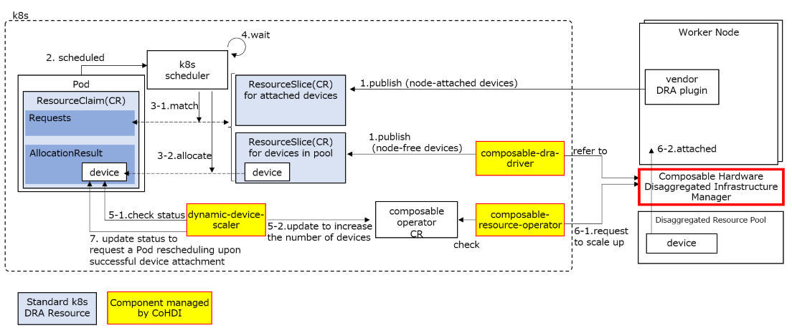
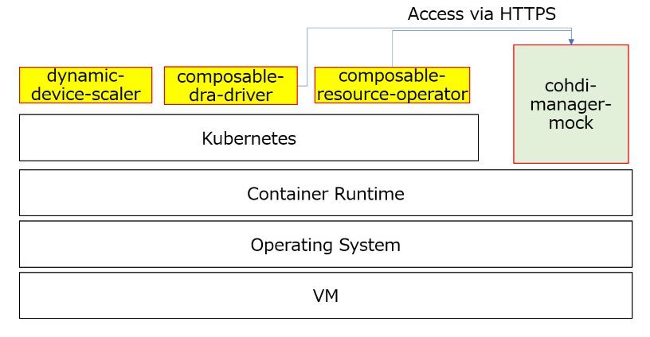

# Readme

This document describes the procedures for building and launching a mock environment to test CoHDI, as well as how to perform CoHDI testing using the mock.

> **Note:**  
> In the initial version of the Mock, only CDI DRA testing can be performed because actual GPU attach/detach operations are not supported.  
> This Mock can run in any environment that supports containers.  
> For information about the CoHDI runtime environment, please refer to the Helm page (coming soon).

Please use this Mock as an alternative for Composable Hardware Disaggregated Infrastructure Manager within the red block below.


With this Mock, we aim to be able to verify CoHDI's operation even on virtual machine environments.


---


## 1. Building the Mock

In this procedure, you will work in a directory named mock, created directly under your home directory.

```bash
mkdir -p ~/mock
```

### 1.1 Cloning the Repository

```bash
cd ~/mock
git clone <URL of the Mock repository>
ls ~/mock
```

The structure should be as follows:

```
Dockerfile  Makefile  app.py  in  requirements.txt  certs
```

### 1.2 Certificate Creation

This step generates a server certificate and private key for HTTPS communication with the mock server.

#### 1.2.1 Create the certs Folder:

```bash
mkdir -p ~/mock/certs
cd ~/mock/certs
```

#### 1.2.2 Create the OpenSSL Config File (openssl.cnf):

```bash
vi openssl.cnf
```

Enter the following content:

```ini
[ req ]
default_bits       = 2048
prompt             = no
default_md         = sha256
distinguished_name = dn

[ dn ]
C  = Default Country
L  = Default City
O  = Default Company Ltd
CN = cdimgr.localdomain

[ v3_ca ]
basicConstraints = critical, CA:true
keyUsage = critical, keyCertSign, cRLSign
subjectKeyIdentifier=hash
authorityKeyIdentifier=keyid:always,issuer

[ v3_req ]
basicConstraints = CA:FALSE
keyUsage = critical, digitalSignature, keyEncipherment
extendedKeyUsage = serverAuth, clientAuth
```

#### 1.2.3 Create the CA Private Key and Certificate:

```bash
openssl req -x509 -newkey rsa:2048 -days 365 -keyout ca.key -out ca.crt   -config openssl.cnf -extensions v3_ca -nodes
```

#### 1.2.4 Create Server Private Key and CSR:

```bash
openssl req -new -nodes -newkey rsa:2048   -keyout server.key -out server.csr   -config openssl.cnf -extensions v3_req
```

#### 1.2.5 Create Server Certificate Signed by CA:

```bash
openssl x509 -req -in server.csr -CA ca.crt -CAkey ca.key -CAcreateserial   -out server.crt -days 3650 -sha256 -extensions v3_req -extfile openssl.cnf
```

#### 1.2.6 Verify the Output:

```bash
ls ~/mock/certs
```

The structure should be as follows:

```
ca.crt  ca.key  ca.srl  openssl.cnf  server.crt  server.csr  server.key
```

### 1.3 make：

```bash
cd ~/mock
make
```

After executing the command, a container image named `mock_cohdi:test` will be created.

#### 1.3.1 Verify the Container Image:

```bash
docker images | grep mock_cohdi
```

The output should be as follows:

```
mock_cohdi    test       <image UUID>   23 hours ago   133MB
```

---

## 2. Starting the Mock

Start a container named `mock_cohdi:test`.

Here's an example for launching it using Kubernetes (includes pod and service definitions).

### 2.1 Using the Image in Kubernetes

When Kubernetes uses containerd as its runtime, you cannot directly use images built with Docker.

In that case, please import the image into containerd using the following commands:

```bash
docker save mock_cohdi:test -o mock_cohdi.tar
sudo ctr -n k8s.io images import mock_cohdi.tar
```

After running the above commands, verify that the image has been imported successfully with:

```bash
sudo crictl images | grep mock_cohdi
```

The output should be as follows:

```
docker.io/library/mock_cohdi              test                <image UUID>       206MB
```

### 2.2 Create Pod Definition File (mock-server.yaml):

```yaml
apiVersion: v1
kind: Pod
metadata:
  name: mock-server
  labels:
    app: mock-server
spec:
  containers:
  - name: mock-server
    image: mock_cohdi:test
    ports:
    - containerPort: 443
---
apiVersion: v1
kind: Service
metadata:
  name: mock-server
spec:
  selector:
    app: mock-server
  type: ClusterIP
  ports:
  - protocol: TCP
    port: 443
    targetPort: 443
```

### 2.3 Launch the Pod with the Following Command:

```bash
kubectl apply -f mock-server.yaml
```

### 2.4 Check Pod Status:

```bash
kubectl get pods -A | grep mock
```

If the status is `Running`, the pod has successfully launched.

---

## 3.CoHDI Deployment

Please refer to the Helm-based installation method (coming soon).

In the CoHDI configuration, please set the parameters for the CDI management software's ENDPOINT and certificate to point to the mock server's IP address and certificate.

---

## 4.Testing Using the Mock

### 4.1 composable-dra-driver

The composable-dra-driver exposes devices as ResourceSlice objects according to the number of resources in the resource pool.
To change the number of resources in the pool, do the following:

Log in to the mock container using the following command:

```bash
kubectl exec -it mock-server -- bash
```

Open the file using the following command:

```bash
vi /app/in/machines/00000000-0000-0000-0000-000000000001/available.json
```

> **Note:** Please rename or edit both the parent directory name `00000000-0000-0000-0000-000000000001` of the JSON file to be edited, as well as any occurrences of the string `00000000-0000-0000-0000-000000000001` within the JSON files under the `in` directory, so that they match the `machine_uuid` specified in the `providerID` of the Node resource for the node under test.

Modify the value of `reserved_res_num_per_fabric`.
After making changes, they will be reflected in the following command output within about 1 minute:

```bash
kubectl get ResourceSlice -o yaml
```

### 4.2 composable-resource-operator

This version of the mock does not yet support testing for dynamic scaling.

### 4.3 dynamic-device-scaler

This version of the mock does not yet support testing for dynamic scaling.

